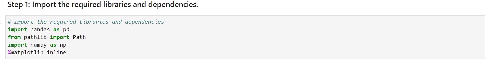

# Whale Funds Analysis
The purpose of the whale funds analysis project is to leverage the power of Python along with the Pandas library and Jupyter lab to analyze portfolio risk and return of four whale funds against the S&P 500 and evaluate the performance of the assets based on key-risk management metrics:

- Daily returns
- Standard deviations
- Sharpe ratios
- Betas
 
The visualizations generated from each quantitative analysis should allow us to analyze performance, volatility, risk-return profile, and portfolio diversification and ultimately aid in identifying the fund with the most investment potential. 

---

## Technologies

The whale funds analysis leverages Python 3.8+ and utilizes the following project libraries and dependencies:
* [JupyterLab](https://jupyterlab.readthedocs.io/en/stable/) - a single integrated development environment (IDE) that allows you to write and run Python programs and review the results in one place
* [Pandas](https://pandas.pydata.org/) - a software library designed for open source data analysis and manipulation
- [matplotlib](https://matplotlib.org/) - library for creating visualizations in Python
- pathlib
- numpy


---

## Installation Guide


Download Anaconda for your operating system and the latest Python version, run the installer, and follow the steps. Restart the terminal after completing the installation. Detailed instructions on how to install Anaconda can be found in the [Anaconda documentation](https://docs.anaconda.com/anaconda/install/).


---

## Usage
The whale fund analysis is hosted on the following GitHub repository at: https://github.com/nguyenthuyt/whale_analysis   

### **Run instructions:**
To run the whale fund arbitrage analysis, simply clone the repository or download the files and launch the **risk_return_analysis.ipynb** in JupyterLab

To launch JupyterLab, follow these steps:

In your open terminal window (Terminal for macOS or Git Bash for Windows), navigate (`CD`) to the repo directory and then confirm that the term (dev) appears at the beginning of your command prompt. Type:
```python
conda activate dev
```

Then type: 
```python
jupyter lab
```

An instance of the JupyterLab user interface automatically opens in your browser. On the left-hand side menu, double-click the **risk_return_analysis.ipynb** file to open the notebook.


Navigate to **'Run'** on the menu bar and select **'Run All Cells'** from the drop-down menu. Otherwise, run each individual cell with ctrl+enter.


If running each cell individually, first run the cell to import the required libraries and dependencies: 




### **Step 1: Import the data**
Before using, it is required to load market data. Use the following code to load the CSV files to a DataFrame (df), ensure the CSV path is correct and run the code:

`df = pd.read_csv(Path("*insert file path here.csv*"), index_col="date", parse_date=True, infer_datetime_format=True)`

In this analysis we are loading a market data file for the four whale funds and the S&P 500 which is located in the Resources folder as 'whale_navs.csv'. 


To confirm the data was imported properly, use the head and/or tail function to review the data:

`display(df.head())`

`display(df.tail())`


### **Step 2: Prepare the data**
Quantitative analysis involves evaluating the success or failure of an investment. This is completed by calculating and comparing the return on investment rather than analzying the prices as prices could be wildly different from one asset to another. In order to convert the DataFrame of prices to daily returns: 

- Type `df.pct_change()`. If NaN values exist, type `df.dropna()` to drop all NaN values. 


### **Step 3: Quantitative Analysis**

In this phase, graphical visualizations along with fund statistics will be generated to analyze the data to identify the best portfolio diversification strategy. The matplotlib dependency is utilized here to plot the data visualization. Based on the resulting visualizations, you can evaluate how the different funds compare against the S&P 500 over time. 

*(Detailed instructions for calculating and plotting the various metrics can be found in the **risk_return_analysis.ipynb** file.)*

- ANALYZE THE PERFORMANCE: 
Use the `plot` and `cumprod` function to graph the daily return data and cumulative returns to determine whether any funds outperform the S&P 500.


- ANALYZE THE VOLATILITY:
Use `plot` with the `kind="Box"` parameter to visualize the daily return data for each of the four portfolios and the S&P 500. A side by side box graphical presentation of the funds provides a better visualization of which funds are the most and least volatile. Larger boxes, longer whiskers, and several outliers are indicators of being more volatile.


ANALYZE THE RISK:
Use the pandas function `std` to calculate the standard deviation and annual standard deviation of the daily returns. Then, use the rolling window function to calcuate the rolling standard deviation for a 21-day rolling window. A higher standard deviation is typically representative of a higher risk asset and a lower standard deviation is typically representative of a lower risk asset. Use the `plot` function of the rolling standard deviation to determine which funds have similar movements with the S&P 500.


ANALYZE THE RISK-RETURN PROFILE:
Using the annualized average return, calculate the Sharpe ratio for the four funds. The Sharpe ratio is calculated as the annualized average return over the annualized standard deviation. The Sharpe ratio takes into the risk and return profile of an asset. Using the `plot` function with the `kind=bar` parameter to visualize the risk-return profiles of the four funds and the S&P 500.


DIVERSIFY THE PORTFOLIO:
An optimal portfolio would be one that is properly diversified and aligned with an investor's risk-profile. As such, a beta and covariance can assist with identifying assets that are sensitive to movements in the market and which assets provide the best balance of risk and return. Of the four funds, select two funds to calculate the 60-day rolling covariance and beta. Then, use the '`plot` function to graph the rolling covariance and beta and determine which fund has the most investment potential.  


### **Quit instructions:**
After saving the file, from the menu bar, navigate to **'File'**, select **'Shutdown'** from the drop-down menu and confirm Shut Down.


In your open terminal window, deactivate the dev environment by typing:
```python
conda deactivate
```

---

## Contributors

The whale fund analysis was created as part of the Rice Fintech Bootcamp 2022 Program by:

Thuy Nguyen

Email: nguyen_thuyt@yahoo.com

LinkedIn: nguyenthuyt


---

## License

MIT


